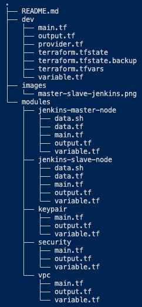
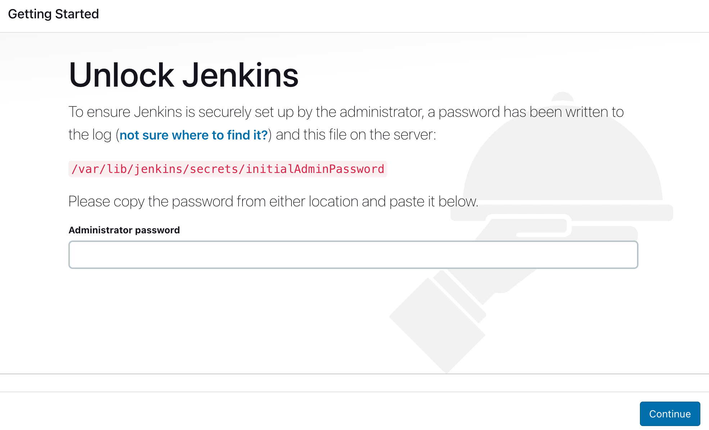
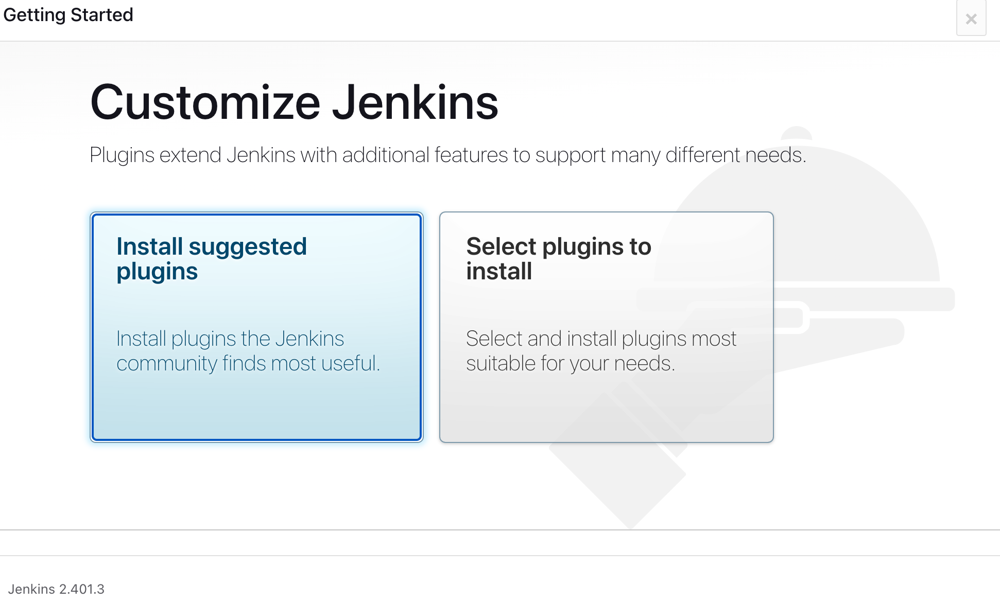
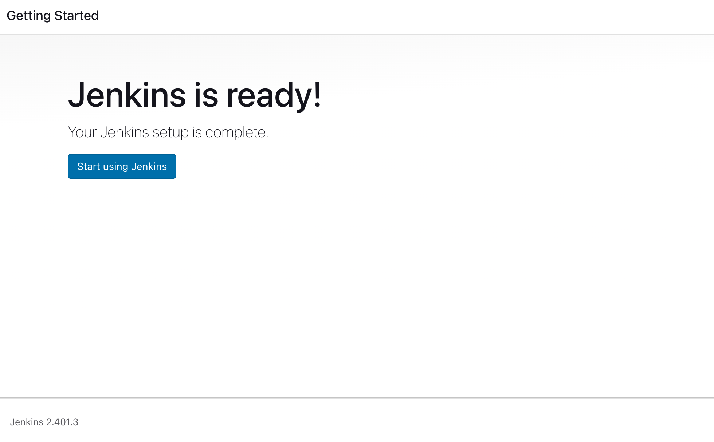
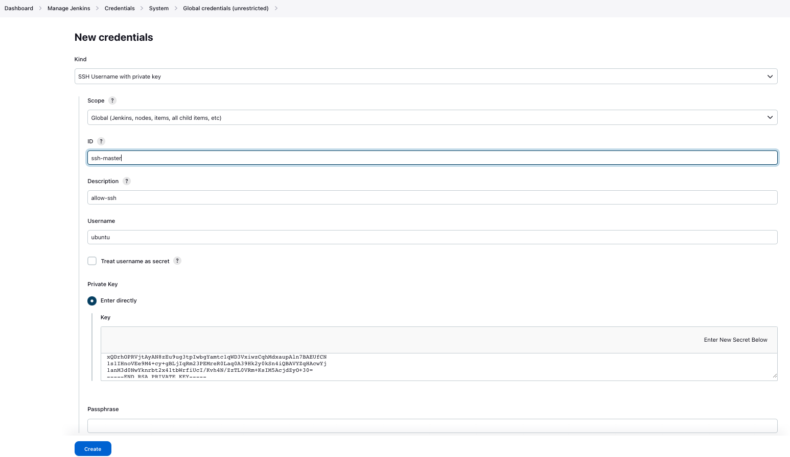
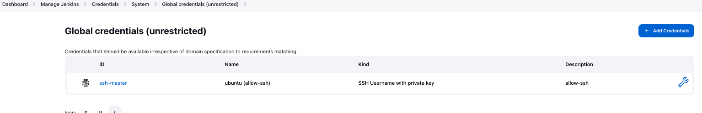
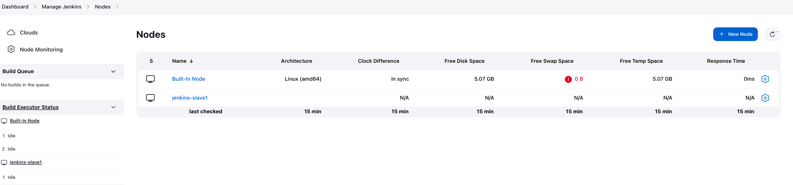
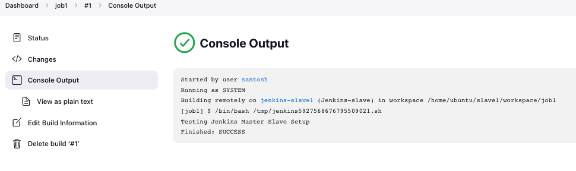
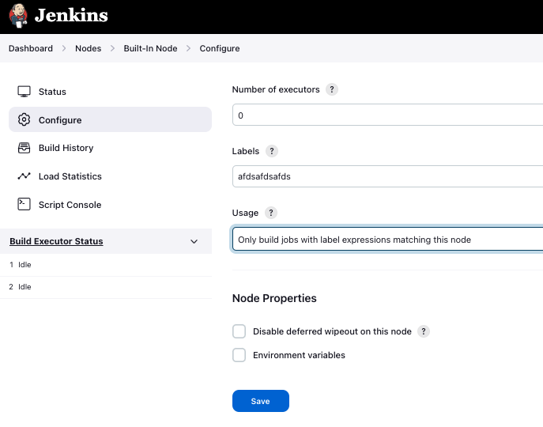

# Jenkins Master/Slave Setup using terraform

We will learn how to set up Devops tool Jenkins in master/slave mode. With the growing popularity of Microservices, it is becoming necessary for any company to develop and launch several services at the same time. It's at this point that the CI tools must provide a way for sharing the load across several machines/servers. Jenkins also has the capability of distributing build jobs across a large number of systems, which is known as Jenkins distributed builds. We can set up a farm of build servers using Jenkins to distribute the burden or perform the build jobs in different settings. When we have a large project to build and the load has to be distributed across several machines on the network, distributed builds improve the efficiency of the build process. Jenkins implements the Master/Slave architecture to manage distributed builds.


### Jenkins Master is the primary Jenkins server and is responsible for the following tasks:

- It distributes the builds among the numerous slaves for execution.
- It organizes the build projects.
- It keeps an eye on the slaves at all times.
- Master can also run build jobs directly if necessary but for security reason it is not used now-a-days.
- It keeps track of the build outcomes and shows them.

### Jenkins Slave runs on a remote machine. A slave is responsible for the following tasks:

- Slaves can be operated on a number of different operating systems.
- It responds to the Jenkins Master's demands.
- Apart from the fact that Jenkins executes the build task on the next available save,
- we can always arrange the project to run on a certain sort of slave computer.
- It also completes construction operations that the Master has dispatched.

# Deployment

Here we first deploy single master and single slave aws instances where master instance has jenkins and java installed and slave/worker/agent instance has java as well. To avoid issue of connectivity due to java version compatibility of Jenkins master and Jenkins slave/worker/agent instance;

- Use same java version for both jenkins master and slave/worker/agent

## Terraform

### Pre-requisite:

- Please make sure you create a provider.tf file

```javascript
provider "aws" {
  region                  = var.region
  shared_credentials_file = "~/.aws/credentials"
  profile                 = "default"
}
```

The ‘credentials file’ will contain 'aws_access_key_id' and 'aws_secret_access_key'.

- Keep SSH keys handy for server/slave machines.

Here is a nice article [link](https://www.digitalocean.com/community/tutorials/how-to-set-up-ssh-keys-2) highlighting how to create it or else create them beforehand on AWS console and reference it in the code.



For simplicity purpose, we will be using Linux machine for creating Jenkins Master and Linux Slave. It’s now time to start using terraform for creating the machines.

#### VPC

The module VPC creates virtual private cloud.

#### Security

The module contains terraform code to create instance level traffic inflow and outflow rules.

#### keypair

The module keypair contains terraform code to create ssh keypair on AWS console.

#### Jenkins-slave-node

This module contains terraform code to create slave node(worker/agent) with java.

#### Jenkins-master-node

This module contains terraform code to create master node as Jenkins server with jenkins and java.

### Run the terraform code

To deploy master and slave aws instances, run terraform command under the directory **/dev** because all modules are invoked and deployed from this folder.

```bash
terraform init
```

```bash
terraform validate
```

```bash
terraform apply --auto-approve
```

## Steps for jenkins master and slave configuration

#### Install java on slave node

```bash
#!/bin/bash
#################################
# Author: Santosh
# Date: 27th-July-2023
# version 1
# This code install Java in the ubuntu instances defined as slave node
##################################

sudo apt update -y
sudo apt install openjdk-17-jre -y
sudo apt-get update
```

(This script is on jenkins-slave-node as data.sh and renders on slave instance when terraform deploy via command.)

#### Install Java and Jenkins on master node

```bash

#!/bin/bash
#################################
# Author: Santosh
# Date: 27th-July-2023
# version 1
# This code install jenkins and java in the ubuntu instances
##################################

sudo apt update -y
sudo apt install openjdk-17-jre -y
curl -fsSL https://pkg.jenkins.io/debian-stable/jenkins.io-2023.key | sudo tee \
 /usr/share/keyrings/jenkins-keyring.asc > /dev/null
echo deb [signed-by=/usr/share/keyrings/jenkins-keyring.asc] \
 https://pkg.jenkins.io/debian-stable binary/ | sudo tee \
 /etc/apt/sources.list.d/jenkins.list > /dev/null
sudo apt-get update
sudo apt-get install jenkins -y
sudo systemctl enable jenkins
sudo systemctl start jenkins

```

(This script is on jenkins-master-node as data.sh and renders on master instance when terraform deploy via command.)

##### Access URL http://<public IP of Jenkins server>:8080

We wiil be asked to enter default admin password like below:

In order to access the default admin password we need to login to the jenkins server and run the command

```bash
sudo cat /var/lib/jenkins/secrets/intialAdminPassword
```

and copy & paste in the windows.

On next screen you can see its asking to install the suggested plugins -

On the next screen you will be prompted to create jenkins user and finally we will get default Jenkins Dashboard:


#### Create ssh keys on slave node

```javascript
//Create a key with RSA algorithm with 4096 rsa bits
resource "tls_private_key" "private_key" {
  algorithm = var.keypair_algorithm
  rsa_bits  = var.rsa_bit
}

//create a key pair using above private key
resource "aws_key_pair" "keypair" {
  key_name   = var.keypair_name
  public_key = tls_private_key.private_key.public_key_openssh
  depends_on = [tls_private_key.private_key]
}

//saving the private key at the specific location
resource "local_file" "save-key" {
  content = tls_private_key.private_key.private_key_pem
  //path.module is the module that access current working directory
  filename = "${path.module}/${var.keypair_name}.pem"
  // changes the file permission to read-only mode
  file_permission = "0400"
  depends_on      = [tls_private_key.private_key]
}

```

(Here ssh keypair is created of both master instance and slave instances but for Jenkins master slave configuration the slave keypair is saved as global credentials on master jenkins servers.)

#### Copy keys on master node

In Order to copy the keys on the master use following steps:

- Dashboard
- Manage Jenkins
- Credentials
- System
- Global Credentials(Unrestricted)
- Add credentials



Final output:


#### Join slave node to master

To join the Jenkins slave node to Jenkins Master, perform below steps -

- Select Build Executor Status > New Node > Type - Permanent
- Select below values -
- Name - jenkins-slave1
- Description - jenkins-slave1
- Number of executors - 1
- Remote root directory - /home/ubuntu/slave1
- Labels - jenkins-slave1
- Usage - Use this mode as much as possible
- Launch method - Launch agents via SSH
- Host - <public ip of slave node> e.g. 192.168.0.103
- Credentials - Select the corresponding global credentials key of agents
- Host Key Verification Strategy - manually trusted key verification strategy
- Save and check that new slave node is added and is in sync



#### Test the setup

- Create "New item"
- Enter an item name as **Job1**
- Choose freestyle project
- Select Build as "Execute shell" and run echo command - "Testing Jenkins Master Slave Setup"
- Save and run build - "Build Now" and Once the build is completed we can check the console output - "Building remotely jenkins-slave1" in works



**Important Note:**
Jenkins main controller should execute the job for security reasons therefore, it should pass the job to the corresponding slave nodes and it should be used as maintaining information of the job executed. Therefore, its executors should be set to zero.

- Click at master node
- Configure
- No. of executors=0
- labels= scrambled text i.e. fdkasjfkdsakfjdksaj
- usage= only build with labels expressions matching this node.
- save


