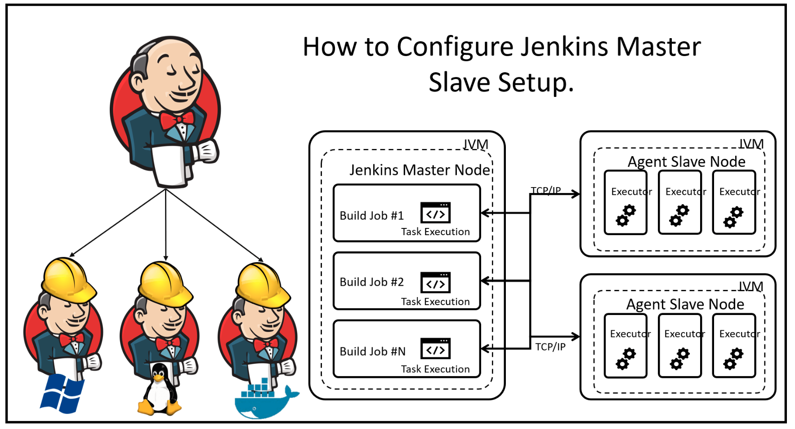

# Jenkins Master/Slave Setup

We will learn how to set up Devops tool Jenkins in master/slave mode. With the growing popularity of Microservices, it is becoming necessary for any company to develop and launch several services at the same time. It's at this point that the CI tools must provide a way for sharing the load across several machines/servers. Jenkins also has the capability of distributing build jobs across a large number of systems, which is known as Jenkins distributed builds. We can set up a farm of build servers using Jenkins to distribute the burden or perform the build jobs in different settings. When we have a large project to build and the load has to be distributed across several machines on the network, distributed builds improve the efficiency of the build process. Jenkins implements the Master/Slave architecture to manage distributed builds.
We may associate a project with the slave node and then schedule it for the build when we've created and configured it.

## Installation

Install my-project with npm

```bash
  npm install my-project
  cd my-project
```


